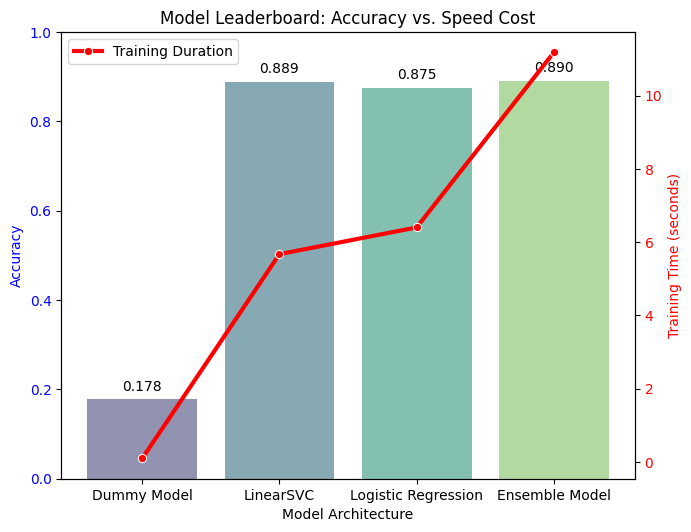

# Kumparan Topic Extractor Engine

An efficient, high-performance machine learning solution for automated news classification, leveraging an Ensemble model to predict article topics with high accuracy under strict time and compute constraints.

## Table of Contents

1. [Project Description](#project-description)
2. [Project Architecture](#project-architecture)
3. [Installation & Usage](#installation--usage)
4. [Methodology & Logic](#methodology--logic)
5. [AI Usage Transparency](#ai-usage-transparency)
6. [Future Improvements](#future-improvements)
7. [References](#references)

## Project Description

In the fast-paced world of digital media, organizing thousands of incoming articles into relevant topics (e.g., Economy, Sports, Technology) is critical for user experience and content discovery. Our project proposes an automated Topic Extractor Model designed to classify Indonesian news articles based on their content, eliminating the inefficiencies and errors associated with manual tagging.

Our solution implements a robust Ensemble Learning approach, combining Linear Support Vector Classification (LinearSVC) and Logistic Regression. This architecture was chosen to balance high accuracy in handling severe class imbalances with extreme computational efficiency, ensuring the training procedure completes in under 20 seconds. The model evaluates performance using Accuracy and Macro F1-Score, ensuring that minority classes are accurately captured without relying on heavy pre-trained transformers.

## Project Architecture

The project's architecture has a structured folder layout for better organization and accessibility. This structure complies with the professional standard I have developed and refined over 5 years as a Data Scientist and AI Engineer, which can be viewed in detail [here](https://github.com/hardefarogonondo/data-science-project-folder-structure).

The project's folder structure is organized as follows:

```bash
.
├── data
│   ├── processed          # Pickled dataframes after splitting (train/test)
│   └── raw                # Original dataset (data.csv)
├── models
│   └── best_model.pkl     # The final trained ensemble model pipeline
├── notebooks
│   ├── 1_exploratory_data_analysis_and_preprocessing
│   └── 2_model_training_and_evaluation
├── references             # Project guideline
├── reports
│   ├── figures            # Generated visualizations
│   └── model_leaderboard.csv
├── src
│   └── model.py           # Main interface script (Train/Predict/Save)
├── data.csv               # Root-level dataset for submission compliance
├── model.pickle           # Root-level output model for submission compliance
├── model.py               # Root-level script for submission compliance
├── LICENSE
└── README.md
```

## Installation & Usage

This project is designed to be lightweight and executable, complying with the requirement for a standalone `model.py` script.

### 1. Prerequisites

Ensure you have **Python 3.11** installed. You can install all necessary dependencies using the provided requirements file:

```bash
pip install -r requirements.txt
```

### 2. Running the Model Training

The core logic is encapsulated in `model.py`. This script performs the following steps automatically:

1. Loads the raw `data.csv`.
2. Preprocesses text and removes duplicates.
3. Trains the Ensemble Model (LinearSVC + Logistic Regression).
4. Saves the trained pipeline to `model.pickle`.

To run the training pipeline:

```bash
python model.py
```

Expected Output:

```bash
Loading dataset...
Cleaning and Preprocessing data...
Initializing Ensemble Model (LinearSVC + LogisticRegression)...
Training model...
Training finished in 15.76 seconds.
Model saved to model.pickle (via standard pickle)
```

### 3. Using the Model

Once `model.pickle` is generated, the Model class can be used to make predictions on new text:

```python
from model import Model
import pickle

classifier = Model()
classifier.pipeline = pickle.load(open('model.pickle', 'rb'))

topic = classifier.predict("Harga saham gabungan hari ini menguat...")
print(f"Predicted Topic: {topic}")  # Output: 'Ekonomi'
```

## Methodology & Logic

Our approach prioritizes data quality and architectural balance over raw model complexity, adhering to the strict 30-minute training limit.

### 1. Preprocessing: The Scorched Earth Strategy

The dataset contained significant noise, including duplicates and conflicting labels (same text, different topics).

- **Duplicate Handling**: We implemented a Keep First strategy for exact duplicates.
- **Conflict Resolution**: We utilized a Scorched Earth method—identifying text bodies associated with multiple different topics and removing them entirely. This prevents the model from learning ambiguous patterns (e.g., if the same article is labeled both "News" and "Politics").
- **Junk Removal**: Articles with fewer than 20 words (often placeholders like "tes") were filtered out.

### 2. Model Selection: The Ensemble Approach

We benchmarked three architectures using 5-fold Cross-Validation:

- **Dummy Baseline**: *Dummy Classifier* (Accuracy ~20%).
- **Candidate 1**: *LinearSVC* (High speed, good handling of sparse TF-IDF matrices).
- **Candidate 2**: *Logistic Regression* (Provides probability calibration).

**Final Decision**: We constructed a *Voting Ensemble* combining *LinearSVC* and *Logistic Regression*.

LinearSVC is excellent at finding the maximum margin between classes, while Logistic Regression offers better probability estimates. Combining them via Soft Voting yielded the highest **Macro F1-Score (0.73)** and **Accuracy (~89%)**, effectively handling the Long Tail of rare topics (e.g., Jakarta, Keuangan) better than any single model.

## Model Evaluation

To validate the correctness of the method, we used two primary metrics:

- **Accuracy (0.89)**: Measures overall correctness. Given that the "Ekonomi" class dominates the dataset, accuracy alone can be misleading.
- **Macro F1-Score (0.73)**: This is our primary metric for success. It calculates the F1 score for each class independently and then averages them. This penalizes the model if it performs well on "Ekonomi" but fails on rare classes like "Regional". A score of 0.73 indicates strong performance across all 29 topics, not just the majority ones.

### Performance Leaderboard:

| Model | Accuracy | Macro F1 | Training Time (s) |
| :--- | :---: | :---: | :---: |
| **Ensemble (Final)** | **0.8905** | **0.73** | 16.1s |
| LinearSVC | 0.8886 | 0.72 | 5.7s |
| Logistic Regression | 0.8747 | 0.70 | 6.4s |
| Dummy Baseline | 0.1780 | 0.02 | 0.1s |

The chart below visualizes this leaderboard, comparing the Accuracy (represented by the bars) against the Training Duration (represented by the red line). This comparison confirms that the **Ensemble model** achieves the highest accuracy while maintaining a highly efficient runtime.



## AI Usage Transparency

In compliance with the guidelines regarding AI tools, I declare the following usage of AI (specifically LLMs like Gemini) in this project:

- **Code Refactoring & Boilerplate**: AI was used to generate the skeleton for the Model class structure in `model.py` and to refine the plotting code for the confusion matrix visualization to ensure aesthetic clarity.
- **Debugging**: AI assisted in resolving a version conflict with the `kumparanian` library's save() method, suggesting the fallback to standard pickle serialization.
- **Documentation**: AI was used to draft sections of this README based on my technical notes and project structure standards.

**Statement of Accountability**: While AI tools expedited coding and documentation, the core engineering decisions, specifically the Scorched Earth cleaning strategy, the choice of an Ensemble architecture over Deep Learning due to time constraints, and the metric selection, are entirely my own. I have verified all code logic and take full responsibility for its accuracy and performance.

## Future Improvements

If given more time and computational resources, I would implement the following improvements to enhance the model's robustness and scalability:

### 1. Advanced Data Engineering

- **Refined Data Cleaning (Beyond Scorched Earth)**
  - **Current Approach**: We used a Scorched Earth strategy, dropping any content with conflicting labels to ensure training purity. This resulted in minor data loss.
  - **Improvement**: Implement Active Learning or Semi-Supervised Labeling to resolve ambiguities. Instead of discarding conflicting rows, we could use a secondary model to re-evaluate the correct label or flag them for manual human review, preserving valuable training examples.

- **Data Augmentation for Minority Classes**
  - **Current Issue**: Classes like `Jakarta` and `Keuangan` are severely underrepresented.
  - **Improvement**: Apply NLP augmentation techniques (e.g., Back-Translation or Synonym Replacement using libraries like `nlpaug`) to synthetically generate more training samples for these minority classes. This would create a more balanced distribution than simple class weighting.

- **Scientific Thresholding for Noise Removal**
  - **Current Approach**: We removed articles under 20 words based on an educated heuristic.
  - **Improvement**: Perform a Quantile Analysis on the character/word count distribution. By calculating the exact 1st or 5th percentile of the training corpus, we can set a statistically derived threshold for junk content, ensuring we don't accidentally remove legitimate but short breaking news updates.

### 2. Feature Engineering & Model Architecture

- **Text Length Binning**
  - **Idea**: Article length often correlates with specific topics (e.g., Breaking News is short, Deep Dive Analysis is long).
  - **Improvement**: Create a categorical feature by binning word counts (e.g., Short, Medium, Long) and feeding this as an additional input to the model alongside the TF-IDF vectors.

- **Semantic Deep Learning (IndoBERT)**
  - **Current Issue**: The model struggles to distinguish semantically similar topics like `Bisnis` vs. `Ekonomi`.
  - **Improvement**: Fine-tuning a pre-trained Indonesian Transformer model (IndoBERT) would capture contextual nuances better than TF-IDF.

### 3. Comprehensive Evaluation

- **Extended Error Analysis**
  - **Improvement**: Beyond simple Accuracy and F1 scores, implement Precision-Recall Curves specifically for the minority classes. Additionally, a Confusion Analysis module could automatically extract and display the specific text samples that fooled the model, helping to identify patterns in misclassification (e.g., "Are we failing on sarcasm? Or foreign loanwords?").

### 4. Deployment

- **API & Containerization**
  - Wrap the predict function in a FastAPI service and containerize it with Docker, making the model ready for real-time production traffic rather than just script execution.

## References

This section lists all the references and resources utilized during the development of this project.

[1] [Data Science Project Folder Structure](https://github.com/hardefarogonondo/data-science-project-folder-structure)

[2] [Scikit-Learn Documentation: LinearSVC](https://scikit-learn.org/stable/modules/generated/sklearn.svm.LinearSVC.html)

[3] [Scikit-Learn Documentation: Ensemble Methods](https://scikit-learn.org/stable/modules/ensemble.html)